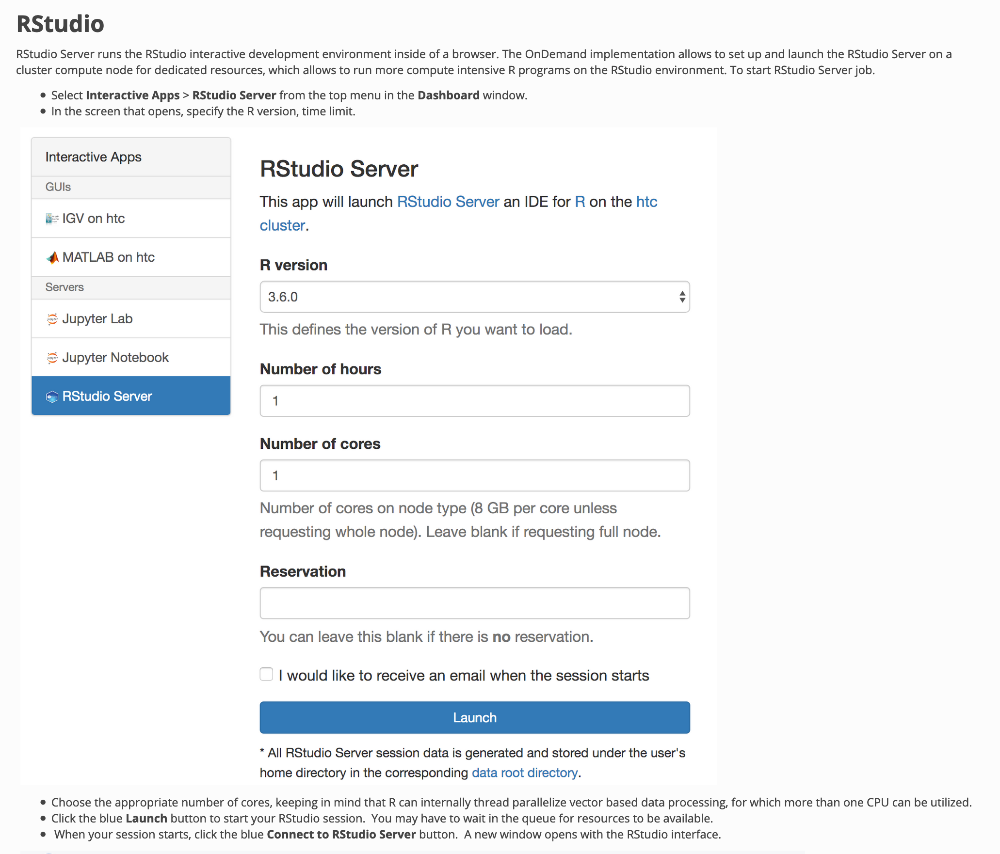

### Copy Tutorial to working directory

##```{r}
##system("cp -rp /ihome/crc/training/fall2019/R_Introduction $HOME")
##```

### Set working directory to $HOME/R_Introduction

##```{r}
##myhome <- paste0(system("echo $HOME", intern = TRUE),"/R_Introduction")
##```

##```{r}
##myhome
##```
##```{r setup}
##setwd(myhome)
##knitr::opts_knit$set(root.dir=myhome)
##```

```{r}
getwd()
```

### Output R version
```{r}
R.version.string
```
## Assignment, math, and printing
### Syntax for assignment of variables
```{r}
x <- 25
y <- 75
z <- x + y
```
### Output value of variable
```{r}
x; y; z
```
### Concatenate and output
```{r}
cat(x,y,z)
```
### Concatenate and output
```{r}
cat(x,y,z,"\n")
```
### Combine values into a vector or a list
```{r}
s <- c(x,y,z)
print(s)
```
### Formatting 
```{r}
sprintf("%i %i %i", x,y,z)
```
### Formatting
```{r}
y <- 3.14823423
yy <- c(x,y,z)
sprintf("%1.2f", yy)
```
```{r}
yy
```

## Indexing in data structure
### Syntax for a Vector
```{r}
v <- c(2,4,6,8,10,12)
v
```
### Accessing specific elements of the vector
```{r}
v[c(1,2,3,4,5,6)]
```

```{r}
v[c(1,2,3)]
```

```{r}
v[c(4,5,6)]
```
```{r}
v[3:5]
```
### Syntax for a Matrix
```{r}
m <- matrix(c(1,2,3,4,5,6,7,8,9), nrow=3, ncol=3)
m
```

```{r}
matrix(c(1:5), nrow=2, ncol=5)
```

```{r}
matrix(c(1:5), nrow=2, ncol=5,T)
```

```{r}
m[3,2]
```

### Syntax for data frame

```{r}
students <- data.frame(
  name = c("Jack", "Jill", "Emma", "Billy", "Sarah"),
  hw1 = c(87, 90, 100, 75, 88),
  hw2 = c(95, 65, 95, 85, 100),
  hw3 = c(99, 95, 89, 93, 87),
  quiz1 = c(45, 55, 65, 70, 75),
  quiz2 = c(95, 85, 75, 65, 55),
  final = c(100, 95, 90, 85, 80)
  )
```
### Print out data frame
```{r}
print(students)
```
### Accessing specific element of a data frame
```{r}
students[1,6]
```
### Accessing a row of a data frame
```{r}
students[2,]
```
### Accessing a range of rows and columns
```{r}
students[2:3,c(1,5:7)]
```
### Accessing columns by name
```{r}
students[ ,c("name", "hw2", "final")]
```
```{r}
students[ ,c(1, 3, 7)]
```

## Simple statistics on a data frame
### Output students grades on the final
```{r}
students[ , "final"]
```
### mean, min, max and standard deviation of grades on the final
```{r}
mean(students[ , "final"])
```
```{r}
min(students[ , "final"])
```
```{r}
max(students[ , "final"])
```
```{r}
sd(students[ , "final"])
```
### Summary statistics of grades on the final
```{r}
summary(students[ , "final"])
```
### Summary statistics of specific data columns
```{r}
summary(students[ , c("hw1", "hw2", "hw3")])
```
```{r}
summary(students[c(2:4), c("name","hw1", "hw2", "hw3")])
```

### Sumary statistics of all data
```{r}
summary(students)
```
```{r}
dim(students)
```
## Querying info about variables

### Let's assign some variables

```{r}
x <- 2.5
n <- 8L
nn <- 8.0
lett <- LETTERS[1:8]
```
### Display the structure of above variables
```{r}
str(x)
str(n)
str(nn)
str(lett)
```
### Query if a variable had been declared
```{r}
exists("x")
exists("x_does_not_exist")
```
```{r}
is.integer(n)
```

```{r}
nn <- 318
is.integer(nn)
nnn <- as.integer(nn)
nnn
is.integer(nnn)
```


```{r}
x_does_not_exist <- FALSE
exists("x_does_not_exist")
str(x_does_not_exist)
```
### Let's create a data frame an query it's dimensions
```{r}
n <- 1:8
data <- data.frame(n,lett)
str(data)
```
```{r}
length(n)
length(data)
nrow(data)
ncol(data)
dim(data)
```
## Common Random number operations

```{r}
runif(1)
```

```{r}
myran <- runif(1000)
```

```{r}
myran
```

```{r}
runif(10, min=25, max=50)
```

```{r}
sample(myran, 25, replace=TRUE)
```

```{r}
sample(1:11, 10, replace=FALSE)
```

```{r}
rnorm(10)
```

```{r}
rnorm(10, mean=5, sd=15)
```

```{r}
set.seed(88899)
```

```{r}
runif(10)
```

```{r}
runif(10)
```

```{r}
set.seed(88899)
```


```{r}
runif(20)
```
### Loops

```{r}
for (i in 1:15){
  if (!i %% 2){
    next
  }
  print(paste(i, "is odd"))
}
```

```{r}
imax <- 20
i <- 1
while (i <= imax){
  if( !i %% 2){
    print(paste(i, "is even"))
  }
  i = i + 1
}
```

```{r}
imax <- 20
i <- 1
while (i <= imax){
  if( i %% 2 == 0){
    print(paste(i, "is even"))
  } else {
    print(paste(i, "is odd"))
  }
  i <- i + 1
}
```
## Input: Reading ASCII data

```{r}
getwd()
```

```{r}
list.files()
```

### Read comma-separated data
```{r}
grades <- read.csv("students.csv")
```

```{r}
grades
```

### Read tab-delimited data

```{r}
grades_tab <- read.table("students.tab", header=TRUE, sep="\t")
```

```{r}
grades_tab
```

## Output: writing ASCII data

### Let's modify some data first

```{r}
grades[2, ]
```

```{r}
grades[2,2:7] <- c(100,100,100,100,100,100)
```

```{r}
grades[2, ]
```

```{r}
grades
```

### Write data in csv format

```{r}
write.csv(grades, "students-hacked.csv")
```

### Write data in tab-separated format

```{r}
write.table(grades, "students-hacked.tab", sep="\t")
```

### List files in working directory
```{r}
list.files()
```

## Output: beyond ASCII -- dump

```{r}
dump("grades", "students-hacked.Rdmpd")
```

```{r}
rm("grades")
```

##```{r}
##grades
##```

```{r}
source("students-hacked.Rdmpd")
```

```{r}
grades
```

```{r}
dump(c("grades", "students"), "students-hacked.Rdmpd")
```

```{r}
##system("cat students-hacked.Rdmpd")
file.show("students-hacked.Rdmpd")
```

## Output: beyond ASCII -- saveRDS

```{r}
saveRDS(grades, "students-bin.rds")
```

```{r}
##system("cat students-bin.rds")
file.show("students-bin.rds")
```

```{r}
saveRDS(grades, "students-ascii.rds", ascii=TRUE)
```

```{r}
##system("cat students-ascii.rds")
file.show("students-ascii.rds")
```

```{r}
saveRDS(grades, "students-ascii-nocompress.rds", ascii=TRUE, compress=FALSE)
```

```{r}
##system("cat students-ascii-nocompress.rds")
file.show("students-ascii-nocompress.rds")
```

## Running R scripts and outputting to file

### This outputs to the console
```{r}
source("example.R", print.eval=TRUE)
```

### This outputs to a specified file

##knit does not like sink```{r}
##sink("example.out")
##```

```{r}
source("example.R", print.eval=TRUE)
```

```{r}
system("ls | grep example.out")
```

```{r}
##system("cat example.out")
file.show("example.out")
```
## Using RStudio Server on the CRC cluster





### Parallelization Strategies in R


#### For the latest landscape overview for performing parallel computing within R, see

[CRAN Task View: High-Performance and Parallel Computing with R](https://cran.r-project.org/web/views/HighPerformanceComputing.html)


#### Here, we will only discuss the following R packages

* **foreach**. Provides a new loop construct that can execute repeated tasks in parallel on multiple cores or multiple nodes of a cluster

* **parallel**.  Direct support for “coarse-grained” parallel execution.  Coarse-grained in the sense that large chunks of computation tasks can be farmed out to the cores simultaneously.

* **doMC**.  Provides a parallel backend for the %dopar% function using the multicore functionality of the parallel package.


### Example: foreach

```{r}
library(foreach)
library(doParallel)
```

```{r}
system.time( foreach(i=1:10000) %do% sum(tanh(1:i)) )
```

```{r}
registerDoParallel()
getDoParWorkers()
system.time( foreach(i=1:10000) %dopar% sum(tanh(1:i)) )
```

```{r}
registerDoSEQ(); getDoParWorkers()
```

```{r}
system.time( foreach(i=1:10000) %dopar% sum(tanh(1:i)) )
```

```{r}
registerDoParallel(cores=1); getDoParWorkers()
```

```{r}
system.time( foreach(i=1:10000) %dopar% sum(tanh(1:i)) )
```

```{r}
registerDoParallel(cores=16); getDoParWorkers()
```

```{r}
system.time( foreach(i=1:10000) %dopar% sum(tanh(1:i)) )
```

```{r}
system.time( foreach(i=1:10000) %dopar% sum(tanh(1:i)) )
```

```{r}
registerDoParallel(cores=4)
system.time( foreach(i=1:10000) %dopar% sum(tanh(1:i)) )
```

### Example: foreach randomForest

```{r}
library(randomForest)
```

```{r}
x <- matrix(runif(500), 100)
y <- gl(2, 50)
```

```{r}
rf <- foreach(ntree=rep(250, 4), .combine=combine) %do% randomForest(x, y, ntree=ntree)
rf
```

```{r}
rf <- foreach(ntree=rep(250, 4), .combine=combine, .packages='randomForest') %dopar% randomForest(x, y, ntree=ntree)
rf
```


### Example: Multicore processing

```{r}
library(doMC)
registerDoMC(cores=4)
```

```{r}
library(rbenchmark)
```

```{r}
max.eig <- function(N, sigma) {
  d <- matrix(rnorm(N**2, sd = sigma), nrow = N)
  E <- eigen(d)$values
  abs(E)[[1]]
}
```

```{r}
benchmark(foreach(n = 1:50) %do% max.eig(n, 1),
          foreach(n = 1:50) %dopar% max.eig(n, 1)
)
```


### Example: R on a cluster

```{r}
library(doSNOW)
cluster = makeCluster(4, type = "SOCK")
registerDoSNOW(cluster)
```

```{r}
benchmark(foreach(n = 1:50) %do% max.eig(n, 1),
          foreach(n = 1:50) %dopar% max.eig(n, 1)
)
```

```{r}
stopCluster(cluster)
```

```{r}
cluster = makeCluster(20, type = "SOCK")
registerDoSNOW(cluster)
```

```{r}
benchmark(foreach(n = 1:50) %do% max.eig(n, 1),
          foreach(n = 1:50) %dopar% max.eig(n, 1)
)
```

```{r}
stopCluster(cluster)
```


